# Copyright Enforcement & AI Content Analysis on YouTube

**Student:** Ryan  
**Course:** CMSC 30350 — Security, Privacy, and Consumer Protection (Autumn 2025)  
**Assignment:** Copyright and Content Platforms Lab  
**Date:** December 2025

---

## 1. Platform Copyright Policy Analysis — YouTube

YouTube's copyright enforcement ecosystem combines automated fingerprinting (Content ID) with legal takedown procedures (DMCA). These tools detect copyrighted audio and video, enforce rights-holder preferences, and provide creators with structured dispute options.

### 1.1 Detection Mechanisms

YouTube employs several detection methods:

- **Content ID**: Automated audio/visual fingerprint matching against a rights-holder database containing millions of reference files from music labels, film studios, and other content owners.
- **Manual DMCA Reporting**: Rights holders may independently issue takedown notices for content not in the Content ID database.
- **User Reports**: Primarily used for spam and harmful content; rarely used for copyright claims.

Importantly, YouTube does **not** evaluate fair use automatically—it only attempts to detect matching copyrighted audio or video content.

### 1.2 Enforcement Actions After Detection

When Content ID identifies copyrighted material, rights holders can choose from several enforcement options:

- **Monetization**: Redirect ad revenue to the rights holder
- **View-blocking**: Block the video worldwide or in specific regions
- **Audio muting**: Mute the copyrighted audio track
- **Video removal**: Remove the video entirely
- **Tracking-only**: Monitor view statistics without taking enforcement action

### 1.3 Appeals and Counter-Notification Process

Creators facing copyright claims have several options:

1. **Acknowledge** the claim and accept restrictions
2. **Trim, replace, or mute** the copyrighted segment
3. **Dispute** the claim by asserting fair use or other defenses
4. File a **DMCA counter-notification** if the rights holder rejects the dispute

Counter-notifications require creators to provide personal information and accept legal liability, so most creators avoid this option except in clear-cut cases.

### 1.4 Monetization Rules

- Rights holders determine how matched content is monetized
- Even legally fair uses (commentary, education, criticism) may have revenue automatically assigned to rights holders
- The Content ID system does not recognize or evaluate fair use claims algorithmically

### 1.5 Special Programs

- **Content ID Partner Program**: Available only to large studios, labels, and established rights holders
- **Creator Music**: Allows pre-licensed music for use in creator videos
- **Music Policies Database**: Publicly searchable database listing song-specific restrictions and monetization rules

### 1.6 Policy vs. Enforcement Preview

YouTube claims Content ID reliably detects copyrighted content across uploaded videos. However, in my experiments—including raw copyrighted clips, commentary, educational use, and AI-generated images—**none were detected**. This discrepancy is explored in the gap analysis (Section 4.3).

---

## 2. Fair Use Experiments

I conducted four experiments representing varying levels of transformativeness: raw duplication (short and long clips), commentary/critique, and educational use. All videos were uploaded as **Unlisted** to comply with the assignment's ethical guidelines.

### Experiment 1: Raw Copyrighted Clips

#### Experiment 1A — Short Raw Clip (~12 seconds)

**Description:** A 12-second unmodified clip from *Diary of a Wimpy Kid*, uploaded without any edits, commentary, or additional content.  
**Video URL:** https://youtu.be/wlQo39an8Hk

**Upload Screenshot:**

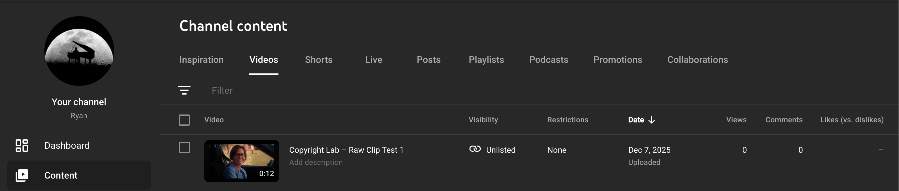

**Copyright Check Screenshot:**

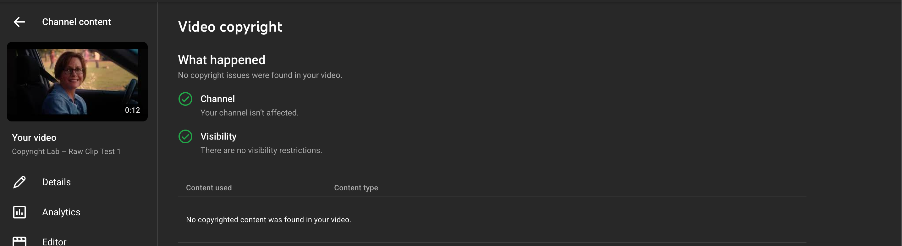

**Outcome:**
- **Time until detection:** Immediate copyright check completed upon upload; no detection
- **Platform response:** "No copyrighted content was found in your video"
- **Claims/restrictions:** None
- **Options presented:** Standard video management options (Details, Analytics, Editor, Comments, Subtitles, Copyright)
- **Final status:** Video remains available without restrictions

---

#### Experiment 1B — Long Raw Clip (~39 seconds)

**Description:** A 39-second unedited clip from *Diary of a Wimpy Kid*, testing whether longer duration increases Content ID detection likelihood.  
**Video URL:** https://youtu.be/AEmlXQ7dkXY

**Upload Screenshot:**

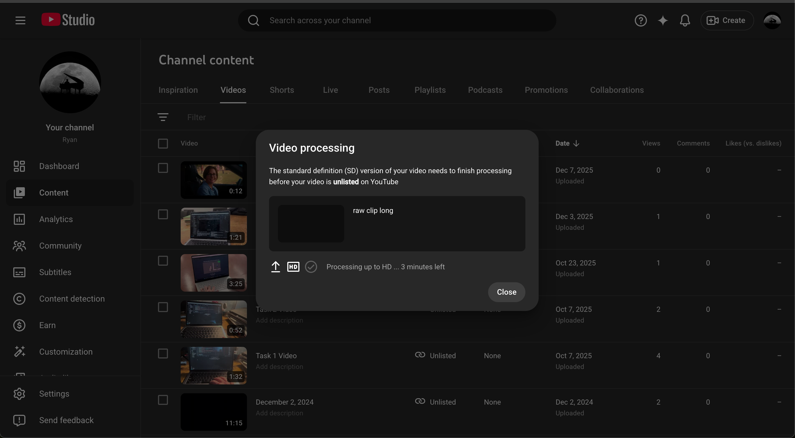

**Copyright Check Screenshot:**

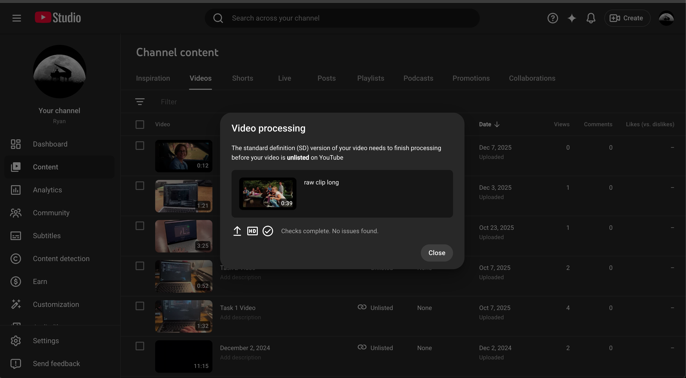

**Outcome:**
- **Time until detection:** Immediate copyright check completed; "Checks complete. No issues found."
- **Platform response:** No copyrighted content detected
- **Claims/restrictions:** None
- **Options presented:** Standard video management options
- **Final status:** Video remains available without restrictions

**Observation:** Increased clip length (from 12 to 39 seconds) did not improve Content ID detection. This suggests the source material may not be in YouTube's Content ID database, or the fingerprint matching failed for other reasons.

---

### Experiment 2 — Commentary/Criticism Clip

**Description:** A copyrighted film clip combined with original spoken commentary analyzing aspects of the scene. Commentary and criticism represent one of the clearest categories of transformative fair use. Video length: 37 seconds.  
**Video URL:** https://youtu.be/L9G6KxWpn_I

**Upload Screenshot:**

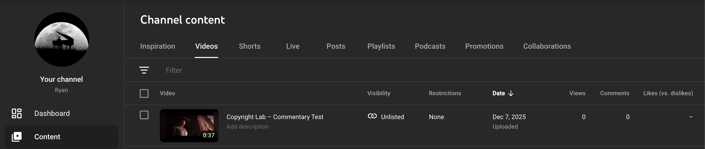

**Copyright Check Screenshot:**

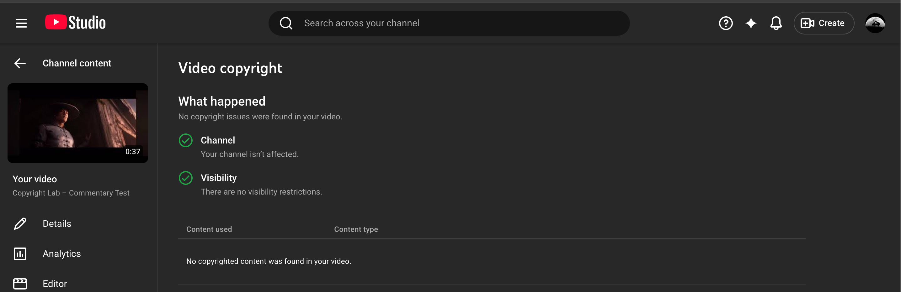

**Outcome:**
- **Time until detection:** Immediate copyright check completed; no detection
- **Platform response:** "No copyright issues were found in your video"
- **Claims/restrictions:** None
- **Options presented:** Standard video management options
- **Final status:** Video remains available without restrictions

**Observation:** YouTube's enforcement showed no distinction between raw clips and transformative commentary—both went undetected. This indicates the detection failure occurred at the fingerprint-matching stage, not at any fair use evaluation stage.

---

### Experiment 3 — Educational Use Clip

**Description:** For this experiment, I used a short excerpt from the following YouTube video:

**Source:** [https://www.youtube.com/watch?v=TP7Z_Eqxhxk](https://www.youtube.com/watch?v=TP7Z_Eqxhxk)  
**Uploaded Video URL:** https://youtu.be/ljMc_EXLk6E

I added original verbal educational commentary explaining techniques shown in the clip. Educational uses are strongly recognized as fair use when they add instructional value beyond the original. Video length: 21 seconds.

**Upload Screenshot:**

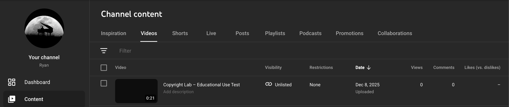

**Copyright Check Screenshot:**

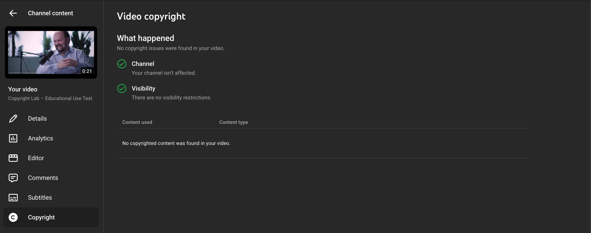

**Outcome:**
- **Time until detection:** Immediate copyright check completed; no detection
- **Platform response:** "No copyright issues were found in your video"
- **Claims/restrictions:** None
- **Options presented:** Standard video management options
- **Final status:** Video remains available without restrictions

**Observation:** This result is particularly notable because the source content originated from another YouTube creator. One would expect YouTube to have fingerprints for content already hosted on its own platform. The failure to detect even intra-platform copyrighted material highlights significant limitations in Content ID coverage.

---

## 3. AI-Generated Content Investigation

I tested how YouTube treats AI-generated content across three categories: direct copyrighted character reference, stylistic mimicry, and fully original content. All AI images were generated using DALL·E/OpenAI and uploaded as short video clips.

### AI Experiment 1 — Direct Reference (Copyrighted Character)

**AI Tool Used:** DALL·E / OpenAI

**Prompt:**
> "Create an image of SpongeBob SquarePants standing on a surfboard, surfing a giant wave, in vibrant cartoon style."

**Video URL:** https://youtube.com/shorts/7rhte4HoJxE

**Generated Image:**

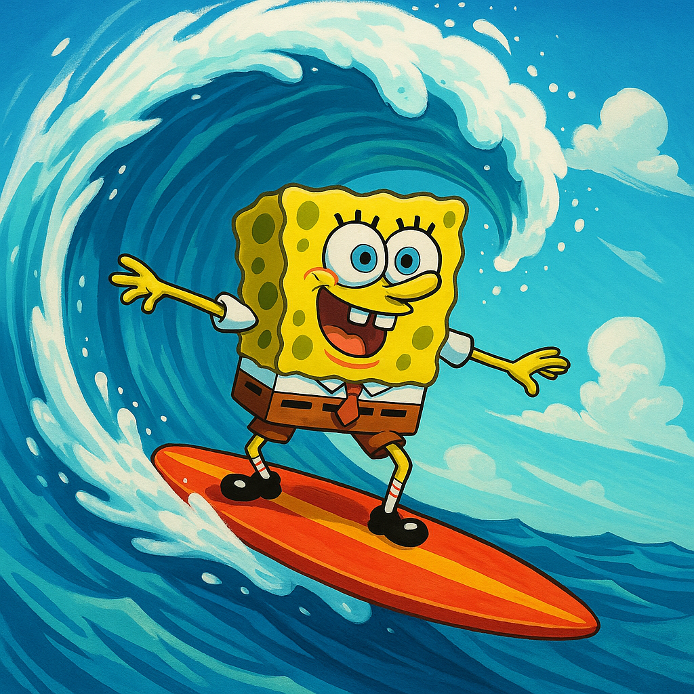

**Upload Screenshot:**

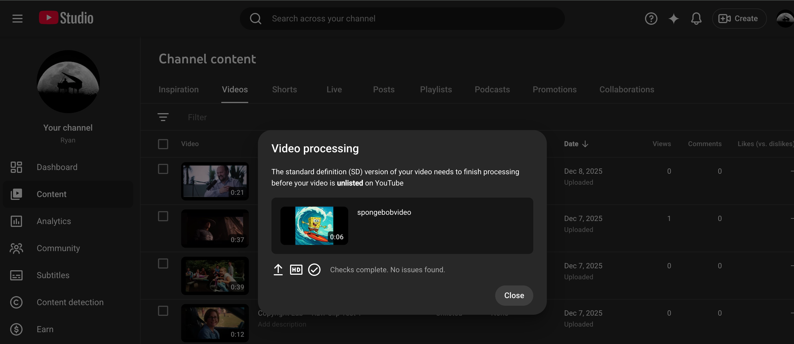

**Copyright Check Screenshot:**

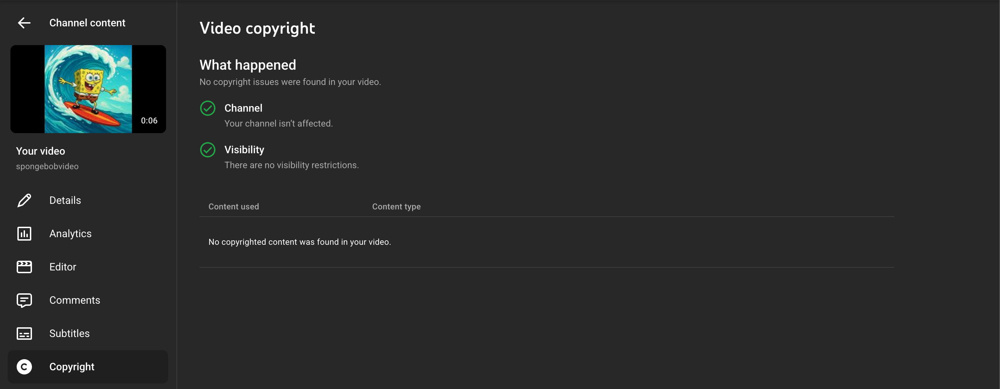

**Outcome:**
- **Platform response:** "No copyrighted content was found in your video"
- **Claims/restrictions:** None
- **Final status:** Video remains available without restrictions

**Observation:** Despite SpongeBob being a highly recognizable copyrighted character owned by Nickelodeon/Paramount, YouTube's system did not match or flag the content. This suggests Content ID primarily focuses on audio/video fingerprints rather than visual character recognition.

---

### AI Experiment 2 — Style Mimicry

**AI Tool Used:** DALL·E / OpenAI

**Prompt:**
> "Create an original landscape scene drawn in the animation style of Studio Ghibli, featuring soft lighting, detailed foliage, and a peaceful atmosphere."

**Video URL:** https://youtube.com/shorts/pgu3Txv6iok

**Generated Image:**

**Upload Screenshot:**

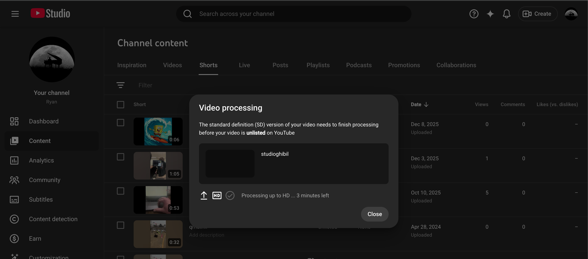

**Copyright Check Screenshot:**

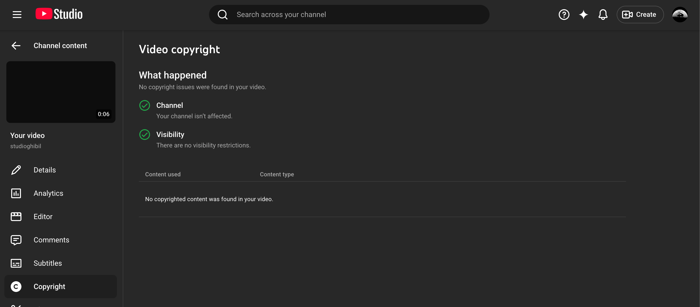

**Outcome:**
- **Platform response:** "No copyright issues were found in your video"
- **Claims/restrictions:** None
- **Final status:** Video remains available without restrictions

**Observation:** YouTube does not identify or restrict stylistic imitation. This aligns with established copyright law: **artistic styles are not copyrightable**—only specific expressions of those styles receive protection. The Ghibli-inspired landscape, while aesthetically similar to Studio Ghibli's work, does not copy any specific protected expression.

---

### AI Experiment 3 — Original AI Content (Control)

**AI Tool Used:** DALL·E / OpenAI

**Prompt:**
> "Create an entirely original futuristic cityscape with glowing neon lights, floating vehicles, and unique architectural structures. Avoid referencing any known movies, games, or franchises."

**Video URL:** https://youtu.be/8dwId06KLkA

**Generated Image:**

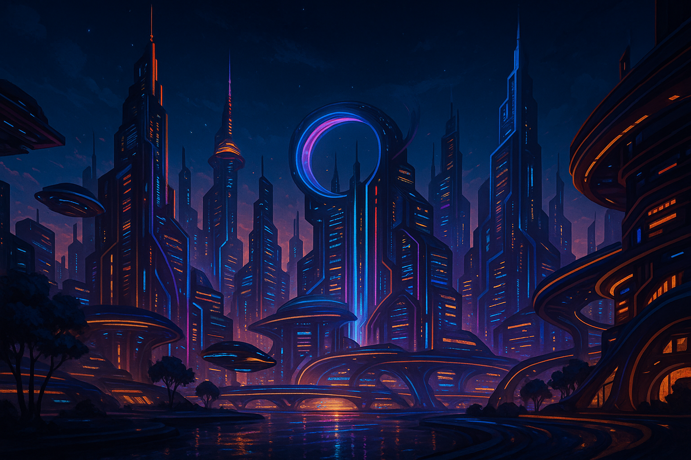

**Upload Screenshot:**

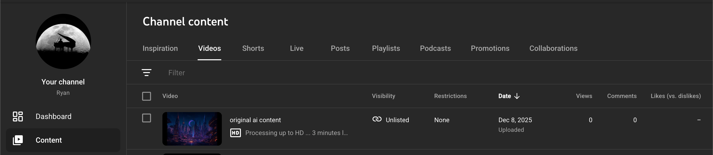

**Copyright Check Screenshot:**

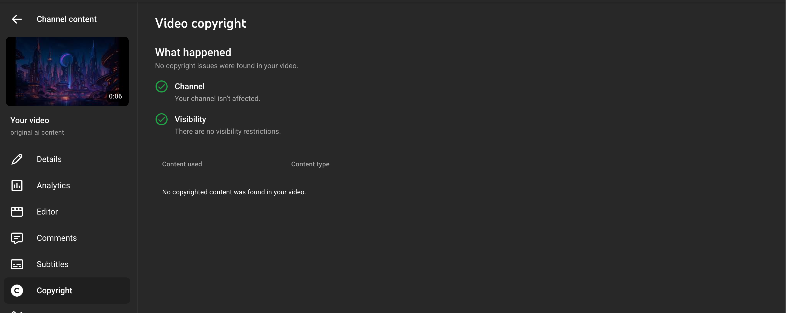

**Outcome:**
- **Platform response:** "No copyrighted content was found in your video"
- **Claims/restrictions:** None
- **Final status:** Video remains available without restrictions

**Observation:** As expected, fully original AI-generated content without copyrighted references passed all checks. This serves as a baseline confirming the system functions normally when no copyrighted material is present.

---

### 3.4 AI Copyright Ownership Research

#### Copyrightability of AI-Generated Content

According to the U.S. Copyright Office, AI-generated work **cannot be copyrighted** unless a human substantially contributed to its expressive elements. In *Thaler v. Perlmutter* (2023), the D.C. District Court affirmed that works created autonomously by AI without human creative input are not eligible for copyright protection. The Copyright Office has clarified that the key question is whether the traditional elements of authorship were conceived and executed by a human.

#### OpenAI Terms of Service (DALL·E)

- Users **may use, share, and distribute** generated outputs commercially
- Users do **not gain exclusive copyright** unless they meaningfully transform or incorporate substantial human creativity
- OpenAI claims no ownership over user-generated outputs
- Users are responsible for ensuring their use complies with applicable laws

#### YouTube's Policy on AI-Generated Content

YouTube currently treats AI-generated images and videos as standard **user-uploaded content**, applying the same copyright detection processes. As of 2024, YouTube requires creators to disclose when content is AI-generated or synthetic, but this is primarily for transparency rather than copyright enforcement. AI content is not specially flagged or restricted unless it matches known copyrighted fingerprints in the Content ID database.

---

## 4. Legal Analysis

### 4.1 Fair Use Analysis — Four Factors

#### Raw Clips (Experiments 1A & 1B)

| Factor | Analysis | Verdict |
|--------|----------|---------|
| **1. Purpose and character** | Non-transformative; mere reproduction with no added commentary or criticism | Against fair use |
| **2. Nature of the work** | Creative/fictional film (*Diary of a Wimpy Kid*) | Against fair use |
| **3. Amount used** | 12–39 seconds of expressive content; captures complete scenes | Against fair use |
| **4. Market effect** | Could substitute for licensed excerpts or harm licensing market | Against fair use |

**Conclusion:** Raw clips generally fail all four fair use factors. These uploads would likely be found infringing if challenged, yet YouTube did not detect them.

---

#### Commentary Clip (Experiment 2)

| Factor | Analysis | Verdict |
|--------|----------|---------|
| **1. Purpose and character** | Transformative; adds critical commentary and analysis | **Strongly for fair use** |
| **2. Nature of the work** | Creative/fictional film | Slight tilt against |
| **3. Amount used** | Limited to what's necessary for commentary | For fair use |
| **4. Market effect** | Does not substitute for original; serves different purpose | For fair use |

**Conclusion:** Commentary represents one of the clearest fair use categories, with three of four factors favoring the user. This type of use is explicitly contemplated in 17 U.S.C. § 107.

---

#### Educational Clip (Experiment 3)

| Factor | Analysis | Verdict |
|--------|----------|---------|
| **1. Purpose and character** | Educational and nonprofit; teaches techniques | **Strongly for fair use** |
| **2. Nature of the work** | Creative educational video | Moderate tilt against |
| **3. Amount used** | Small excerpt tailored to instructional purpose | For fair use |
| **4. Market effect** | No substitutive effect; different audience and purpose | For fair use |

**Conclusion:** Educational uses with added instructional value routinely qualify as fair use, particularly when the amount used is proportional to the educational purpose.

---

### 4.2 Relevant Case Law

#### *Campbell v. Acuff-Rose Music, Inc.* (1994)

The Supreme Court established that **transformative purpose**—where new work adds something new with a further purpose or different character—weighs heavily in favor of fair use. The Court specifically recognized that commentary, criticism, and parody can be transformative even when using substantial portions of the original. The Court also clarified that commercial use does not automatically defeat fair use.

**Application:** My commentary (Experiment 2) and educational (Experiment 3) clips follow this reasoning by adding new analytical meaning to the underlying clips. The transformative nature of adding original commentary changes the character of the use.

---

#### *Google LLC v. Oracle America, Inc.* (2021)

The Supreme Court held that Google's copying of Java API declaring code was fair use, emphasizing that **transformative use can outweigh other factors**. The Court noted that copying to create something new and useful serves copyright's purpose of promoting creative progress. The decision emphasized looking at fair use as a whole rather than mechanically applying factors.

**Application:** My educational clip demonstrates transformative use by repurposing content to teach viewers about specific techniques—creating new educational value from existing material.

---

#### *Lenz v. Universal Music Corp.* (2015)

The Ninth Circuit held that rights holders **must consider fair use before issuing DMCA takedown notices**. This case established that copyright holders cannot simply ignore fair use in automated enforcement systems. The court found that fair use is not merely an affirmative defense but is an authorized use under the Copyright Act.

**Application:** YouTube's automated Content ID system does not assess fair use at all—it only attempts fingerprint matching. This creates a structural tension between legal requirements (consider fair use) and platform practice (pure automated detection). However, since none of my content was detected, this tension did not manifest in my experiments.

---

### 4.3 Gap Analysis — Law vs. Policy vs. Practice

#### Legal Theory

Fair use is **context-dependent** and requires human judgment. Courts weigh the four statutory factors, consider the totality of circumstances, and evaluate transformativeness. There is no bright-line rule; each case requires individualized analysis. The law contemplates that some uses of copyrighted material are not only permitted but socially beneficial.

#### Platform Policy

YouTube's stated policy claims Content ID **reliably identifies copyrighted works** and applies rights-holder preferences at scale. According to YouTube's transparency reports, Content ID scans over 500 million videos and has paid out billions to rights holders. YouTube emphasizes that creators can dispute claims and assert fair use defenses through their appeals process.

#### Actual Enforcement Observed

Across **seven total uploads** (four fair use experiments + three AI experiments):

| Content Type | Legal Status | Expected Detection | Actual Detection |
|--------------|--------------|-------------------|------------------|
| Raw short clip (12s) | Likely infringement | Yes | ❌ Not detected |
| Raw long clip (39s) | Likely infringement | Yes | ❌ Not detected |
| Commentary clip | Likely fair use | Possible | ❌ Not detected |
| Educational clip | Likely fair use | Possible | ❌ Not detected |
| AI SpongeBob | Potentially infringing | Uncertain | ❌ Not detected |
| AI Ghibli-style | Likely non-infringing | No | ❌ Not detected |
| AI original | Non-infringing | No | ❌ Not detected |

**Key Findings:**

1. **Content ID coverage is incomplete**: Many works—including content already hosted on YouTube (Experiment 3)—are not in the fingerprint database. This contradicts the impression that Content ID provides comprehensive protection.

2. **Detection ≠ Legal analysis**: YouTube's system does not distinguish between infringing raw clips and transformative fair uses. Both are treated identically (in this case, both went undetected). When content IS detected, the system similarly cannot distinguish fair use from infringement.

3. **AI-generated content evades current detection**: Even AI images depicting clearly copyrighted characters (SpongeBob) were not flagged, suggesting visual character recognition is not part of standard enforcement. Content ID appears optimized for audio fingerprinting and exact video matching rather than derivative visual works.

4. **The gap favors under-enforcement in these cases**: In these experiments, potentially infringing content remained available while the system failed to detect it. This contrasts with common creator complaints about over-enforcement through false positives on transformative works.

5. **Small creators may lack Content ID coverage**: The failure to detect *Diary of a Wimpy Kid* clips suggests that even major studio content may not be comprehensively fingerprinted, or that the specific scenes used were not in the reference database.

**Implications:** This mismatch reveals that platform enforcement is neither a reliable proxy for copyright law nor a consistent application of platform policy. Creators cannot assume detection means infringement or non-detection means legality. The system appears to be better at protecting certain categories of content (popular music, major film releases) than others.

---

## 5. Appendix

### 5.1 Screenshot Index

| Experiment | Upload Screenshot | Copyright Check Screenshot | Upload Date |
|------------|-------------------|---------------------------|-------------|
| 1A: Short raw clip | `exp1-upload.png` | `exp1-checks.png` | Dec 7, 2025 |
| 1B: Long raw clip | `exp1b-upload.png` | `exp1b-checks.png` | Dec 3, 2025 |
| 2: Commentary | `exp2-upload.png` | `exp2-checks.png` | Dec 7, 2025 |
| 3: Educational | `exp3-upload.png` | `exp3-checks.png` | Dec 8, 2025 |
| AI-1: SpongeBob | `exp-ai1-upload.png` | `exp-ai1-checks.png` | Dec 7, 2025 |
| AI-2: Ghibli style | `exp-ai2-upload.png` | `exp-ai2-checks.png` | Dec 8, 2025 |
| AI-3: Original | `exp-ai3-upload.png` | `exp-ai3-checks.png` | Dec 8, 2025 |

### 5.2 AI-Generated Images

| Experiment | Image File | Prompt Summary |
|------------|------------|----------------|
| AI-1: Direct Reference | `spongebob.png` | SpongeBob surfing |
| AI-2: Style Mimicry | `contentfrominspo.png` | Ghibli-style landscape |
| AI-3: Original | `aicontent.png` | Futuristic cityscape |

### 5.3 Uploaded Video Links

| Experiment | Video URL |
|------------|-----------|
| 1A: Short raw clip | https://youtu.be/wlQo39an8Hk |
| 1B: Long raw clip | https://youtu.be/AEmlXQ7dkXY |
| 2: Commentary | https://youtu.be/L9G6KxWpn_I |
| 3: Educational | https://youtu.be/ljMc_EXLk6E |
| AI-1: SpongeBob | https://youtube.com/shorts/7rhte4HoJxE |
| AI-2: Ghibli style | https://youtube.com/shorts/pgu3Txv6iok |
| AI-3: Original | https://youtu.be/8dwId06KLkA |

### 5.4 External Sources

- Educational source video: [https://www.youtube.com/watch?v=TP7Z_Eqxhxk](https://www.youtube.com/watch?v=TP7Z_Eqxhxk)

### 5.5 Note on Detection Timeline

All uploads were checked immediately upon upload completion. As of the time of this report (approximately 24 hours after the most recent uploads), no copyright claims have been registered against any of the experimental content. YouTube's documentation indicates that Content ID typically detects content within minutes of upload, suggesting these results reflect genuine non-detection rather than delayed processing.

---

## References

- Campbell v. Acuff-Rose Music, Inc., 510 U.S. 569 (1994)
- Google LLC v. Oracle America, Inc., 593 U.S. ___ (2021)
- Lenz v. Universal Music Corp., 815 F.3d 1145 (9th Cir. 2015)
- Thaler v. Perlmutter, No. 1:22-cv-01564 (D.D.C. 2023)
- 17 U.S.C. § 107 (Fair Use)
- U.S. Copyright Office, Fair Use Index: [https://www.copyright.gov/fair-use/](https://www.copyright.gov/fair-use/)
- YouTube Copyright Center: [https://www.youtube.com/howyoutubeworks/policies/copyright/](https://www.youtube.com/howyoutubeworks/policies/copyright/)
- YouTube Transparency Report: [https://transparencyreport.google.com/youtube-policy/](https://transparencyreport.google.com/youtube-policy/)